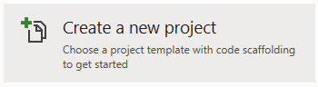

# Setup

## Prerequisites

- Visual Studio w/ .NET Core support components
- Target platform compiler/builder
	- Arduino
	- Atmel Studio
	- Intel MCU Studio (Eclipse)
	- Custom

GOAL: to translate a C# project into a C++ project that can be easily imported into any of the above IDE's. If the project can be built/compiled
without any additional changes, this allows for program pipelining between the translator CLI and another program. For example, the translator creates
a c++ project from a dotnet-iot project, then hands the project directly to the Arduino CMake file which will then generate binaries without any
intermediate editing.

## Create a translatable project

1. Open Visual Studio
2. Create New Project

